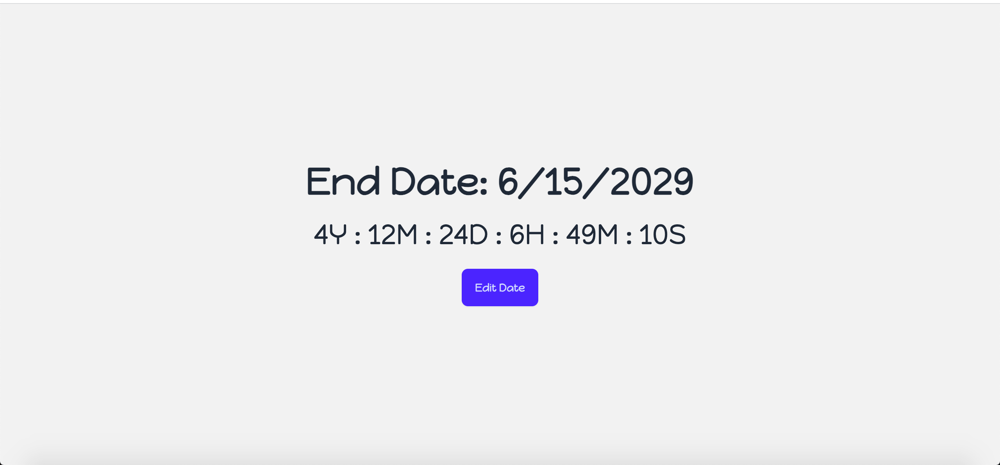
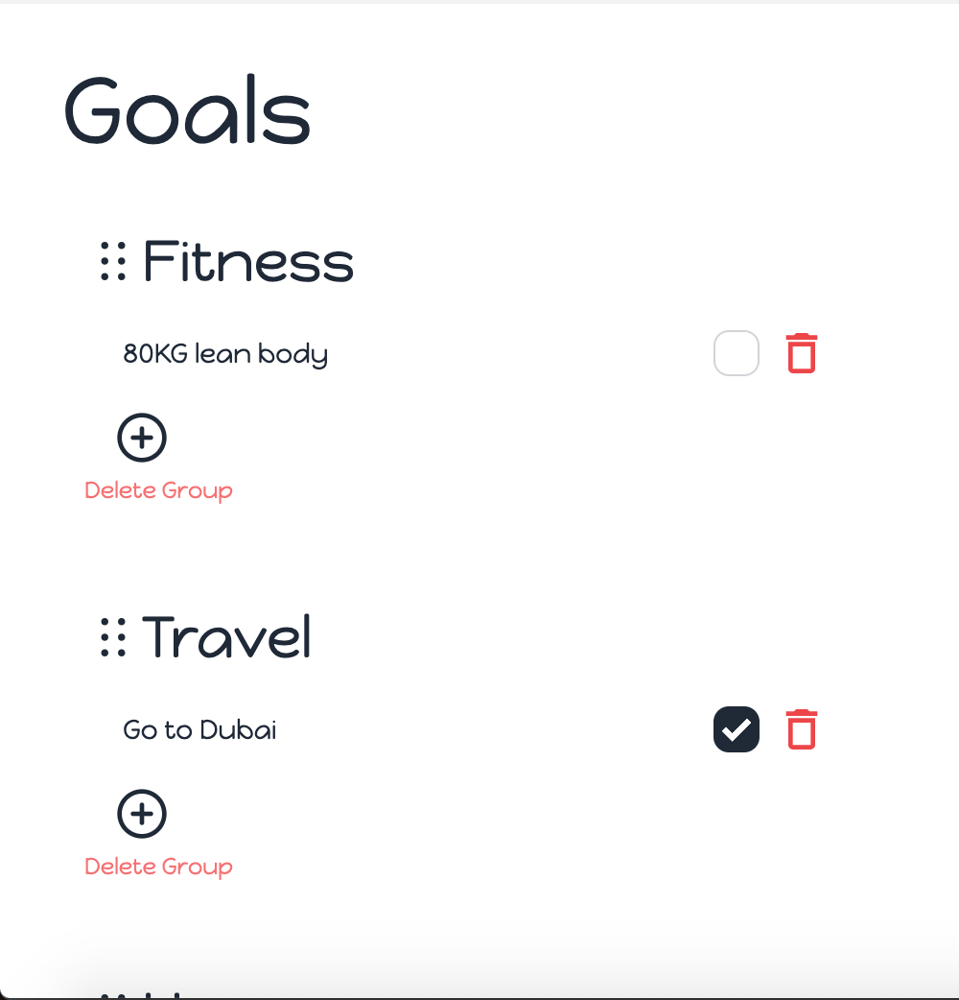

# Goals Tracker App

Welcome to the Goals Tracker App! This beautiful and intuitive application helps users track their goals efficiently by setting deadlines, grouping goals under specific categories, and providing a seamless user experience.

## Table of Contents
- [Features](#features)
- [Tech Stack](#tech-stack)
- [Installation](#installation)
- [Usage](#usage)
- [Screenshots](#screenshots)
- [Contributing](#contributing)
- [License](#license)

## Features
- **User Accounts**: Each user can create an account and manage their goals.
- **Goal Management**: Set long-term goals with specific end date.
- **Grouping**: Organize goals into different groups for better tracking.
- **Responsive Design**: A beautiful, mobile-friendly interface.
- **Animations**: Smooth animations for a delightful user experience.

## Tech Stack
- **Frontend**:
    - [Next.js 14](https://nextjs.org/)
    - [TailwindCSS](https://tailwindcss.com/)
    - [daisyUI](https://daisyui.com/)
    - [Framer Motion](https://www.framer.com/motion/)
    - [React DatePicker](https://reactdatepicker.com/)
    - [React Toastify](https://fkhadra.github.io/react-toastify/)
- **Backend**:
    - [MongoDB](https://www.mongodb.com/) with [Mongoose](https://mongoosejs.com/)
    - [Server Actions for Data Mutations](https://nextjs.org/docs/app/building-your-application/data-fetching/server-actions-and-mutations)

## Installation
To run the project locally, follow these steps:

1. **Clone the repository**:
    ```sh
    git clone https://github.com/waelnassaf/nextjs-goal-tracker
    cd goals-tracker-app
    ```

2. **Install dependencies**:
    ```sh
    npm install
    ```

3. **Set up environment variables**:
   Find `.env` file in the root of your project and add the following variables:
    ```env
    DATABASE_URL=your_atlas_mongodb_uri
   AUTH_SECRET=secret_key_for_your_application
   NEXT_PUBLIC_RECAPTCHA_SITE_KEY=public_google_recapatcha_site_key
    RECAPTCHA_SECRET_KEY=secret_google_recapatcha_key
    ```
   Obtain AUTH_SECRET By running the following command in your terminal
    ```sh
     openssl rand -base64 32
    ```
4. **Run the development server**:
    ```sh
    npm run dev
    ```

5. **Open your browser**:
   Go to [http://localhost:3000](http://localhost:3000) to see the app in action.

## Usage
1. **Sign Up / Log In**:
   Create a new account or log in with existing credentials.

2. **Set an end date**:
   Set an end date to achieve your goals

3. **Create a Goal Group**:
   Organize your goals by creating different groups.

4. **Add Goals**:
   Set your goals under groups.

5. **Do it!**:
   Start working on your goals NOW! You're going to do it!

## Screenshots



## Contributing
We welcome contributions from the community! Please follow these steps to contribute:

1. Fork the repository.
2. Create a new branch (`git checkout -b feature/your-feature`).
3. Commit your changes (`git commit -m 'Add some feature'`).
4. Push to the branch (`git push origin feature/your-feature`).
5. Open a Pull Request.

[//]: # (Please ensure your code adheres to our coding standards and includes relevant tests.)

## License
This project is licensed under the MIT License. See the [LICENSE](LICENSE.txt) file for details.

---

Thank you for using the Goals Tracker App! We hope it helps you achieve your goals efficiently and effectively.
